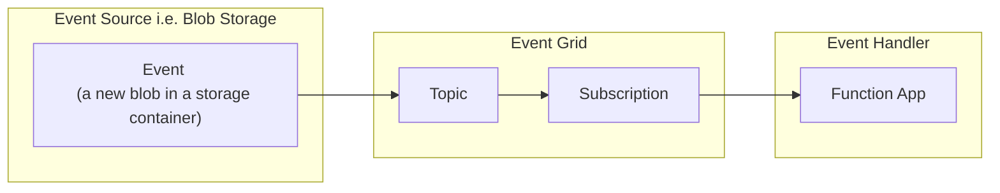

Azure Event Grid events are actually POST https requests sent to the url of subscription. The worklow involving Azure Event Grid is as follows:



Today we are going to implement the above flow locally, although not fully, as there are certain constraints to what we are able to do locally.

Regarding the **Event source**, there is a Azurite Storage Emulator that ideally would send event grid events upon the upload to a new blob. Unfortunately, as of writing this post Azurite Storage Emulator does not have this capability. Therefore, we are going to emulate this part by simply using `curl` (you can also use software like `Postman`) and sending a post request with it to the Azure Event Grid simulator.

# Prep Steps
## Download event grid simulator
Download the local event grid emulator from here:
```
https://github.com/pmcilreavy/AzureEventGridSimulator
```
Go to the folder of the local event emulator:

```bash
cd C:\Programs\AzureEventGridSimulator\src\AzureEventGridSimulator\bin\Release\net7.0
```

Create a file `example.event.data.json` with example event data (that has to be sent to the event topic endpoint):

```json
[
  {
    "id": "8727823",
    "subject": "/example/subject",
    "data": {
      "MyProperty": "This is my awesome data!"
    },
    "eventType": "Example.DataType",
    "eventTime": "2019-01-01T00:00:00.000Z",
    "dataVersion": "1"
  }
]
```

The default Event Grid subscription endpoint is:
```
https://azureeventgridsimulator.requestcatcher.com/
```

This is great to run a few tests with it first, but let's change it to our local function's endpoint:
```
http://localhost:7071/runtime/webhooks/EventGrid?functionName=EventGridTrigger
```

Note the below one will not work locally:
```
http://localhost:7071/runtime/webhooks/EventGrid?functionName=Host.Functions.EventGridTrigger
```

## Write event handler i.e. function app

Create new function app with the following code (Python V2 programming model):

```py
# function_app.py:

import logging
import azure.functions as func
import json

app = func.FunctionApp()

@app.event_grid_trigger(arg_name="azeventgrid")
def EventGridTrigger(azeventgrid: func.EventGridEvent):
    
    result = json.dumps({
        'id': azeventgrid.id,
        'data': azeventgrid.get_json(),
        'topic': azeventgrid.topic,
        'subject': azeventgrid.subject,
        'event_type': azeventgrid.event_type,
    })

    logging.info('Python EventGrid trigger processed an event: %s', result)

```

# Workflow simulation

Go to the folder of the local event emulator:

```bash
cd C:\Programs\AzureEventGridSimulator\src\AzureEventGridSimulator\bin\Release\net7.0
```

Now let's run the `AzureEventGridSimulator.exe`. It will open a new cmd window.

In the separate cmd window let's run this command (i.e. we will send an event data to our event grid emulator topic endpoint):

```bash
curl -k -H "Content-Type: application/json" -H "aeg-sas-key: TheLocal+DevelopmentKey=" -X POST "https://localhost:60101/api/events?api-version=2018-01-01" -d @example.event.data.json
```

In the emulator window we should see output like this:
```bash
[11:38:51 INF] It's alive !
[11:38:56 INF] 1 event(s) received on topic 'ATopicWithATestSubscriber'
```

The event grid emulator now sends a POST request to the subscribers end point, which is our function that runs locally. In the log / terminal you should be able to see output like this:

```bash
 *  Executing task: .venv\Scripts\activate && func host start 

Found Python version 3.10.9 (python).

Azure Functions Core Tools
Core Tools Version:       4.0.5085 Commit hash: N/A  (64-bit)
Function Runtime Version: 4.16.4.20366

[2023-06-12T09:36:57.476Z] Worker process started and initialized.

Functions:

        EventGridTrigger: eventGridTrigger        

For detailed output, run func with --verbose flag.
[2023-06-12T09:37:02.418Z] Host lock lease acquired by instance ID '000000000000000000000000427EF713'.
[2023-06-12T09:38:58.387Z] Executing 'Functions.EventGridTrigger' (Reason='EventGrid trigger fired at 2023-06-12T11:38:58.3516320+02:00', Id=5c2f449a-b64d-41a9-86e4-00ba3cb67ba1)
[2023-06-12T09:38:58.470Z] Python EventGrid trigger processed an event: {"id": "8727823", "data": {"MyProperty": "This is my awesome data!"}, "topic": "/subscriptions/00000000-0000-0000-0000-000000000000/resourceGroups/eventGridSimulator/providers/Microsoft.EventGrid/topics/ATopicWithATestSubscriber", "subject": "/example/subject", "event_type": "Example.DataType"}
[2023-06-12T09:38:58.491Z] Executed 'Functions.EventGridTrigger' (Succeeded, Id=5c2f449a-b64d-41a9-86e4-00ba3cb67ba1, Duration=129ms)
```

Our test event was succesfully processed by our function.